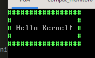

# Bare Bones x86 Kernel
Based off [Bare Bones](https://wiki.osdev.org/Bare_Bones)
and it's [Zig version](https://wiki.osdev.org/Zig_Bare_Bones) on OSDev.org

## Requirements
 - zig
 - grub
 - xorriso
 - qemu

## Building
Windows users can use the `-Dwsl` flag to run GRUB commands through [WSL](https://learn.microsoft.com/en-us/windows/wsl/).

```sh
zig build iso
qemu-system-i386 -cdrom myos.iso
```

You should see a nice message like this!


